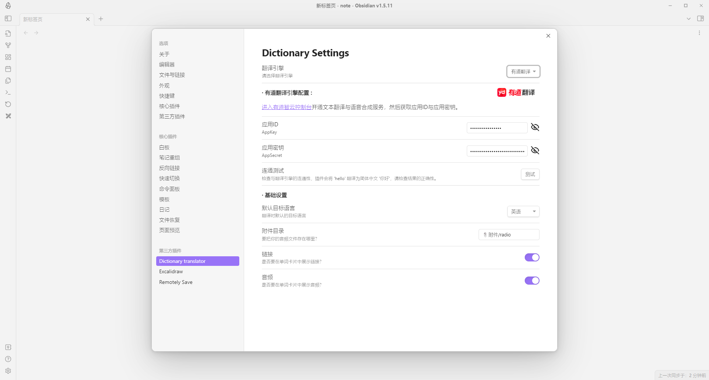
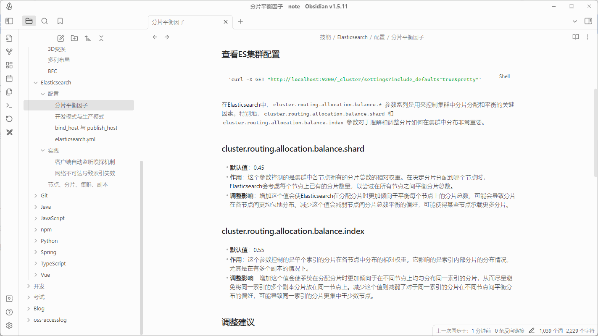

# Obsidian-Dictionary-translator
## 我能帮你做什么？

这是一个简单的插件，帮助你在完成你的知识库的同时可以快速的翻译陌生的单词或句子，并将其生成单词卡插入笔记本中。此外，你还可以将翻译引擎的发音文件保存到你的vault，如果你想，你也可以录制自己的发音。

## 如何使用

1. 配置翻译引擎
  
2. 右键划词翻译 (你可以录制自己的发音)
  

## 翻译引擎支持

- [x] 有道翻译
- [ ] 谷歌翻译
- [ ] 微软翻译

#### 自定义翻译引擎

1. 自定义策略类: 实现`TranslationStrategy`抽象类
2. 在`TranslateEngines`中添加自定义的策略类
	1. 请求自定义的翻译引擎
	2. 解析响应结果，封装为`TranslateResponse`类型的响应
3. 为你的翻译引擎在`setting.ts`中添加独特的配置项

